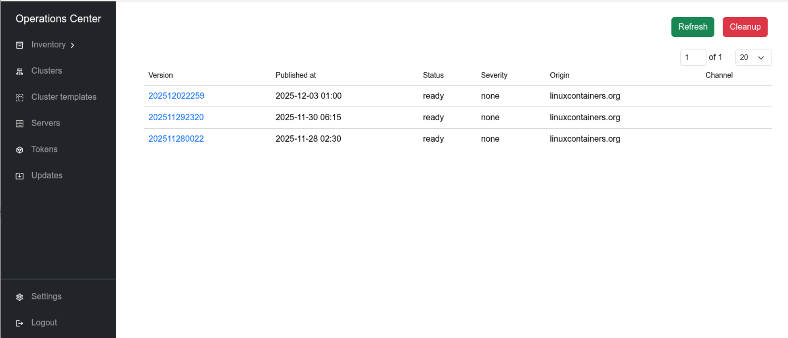
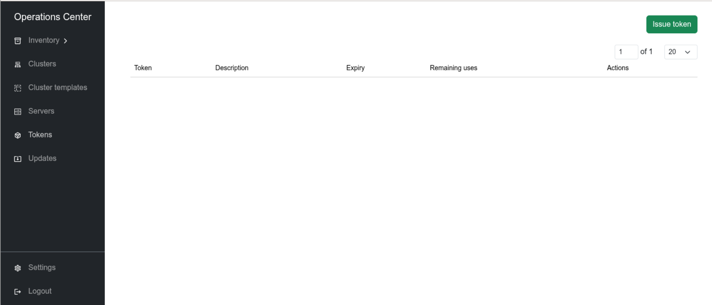
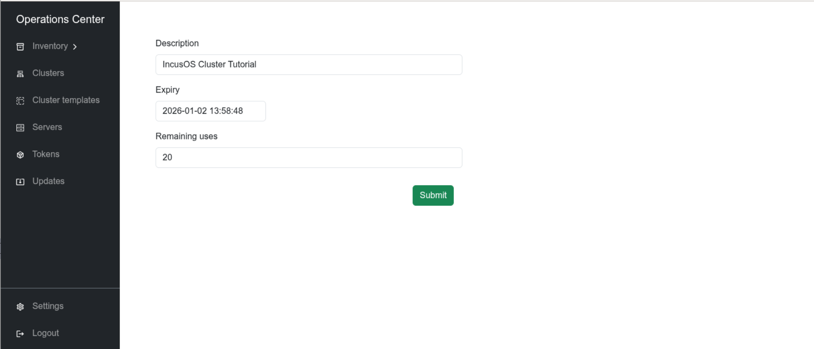
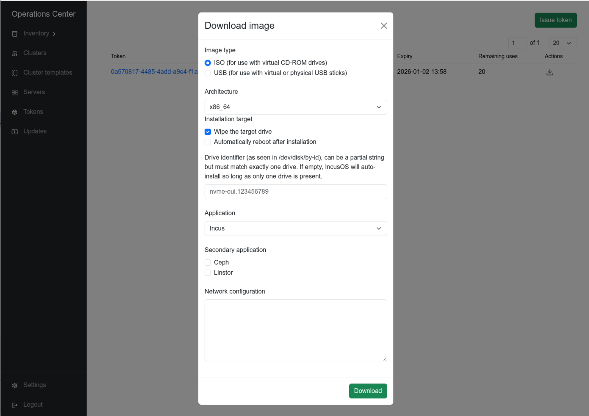
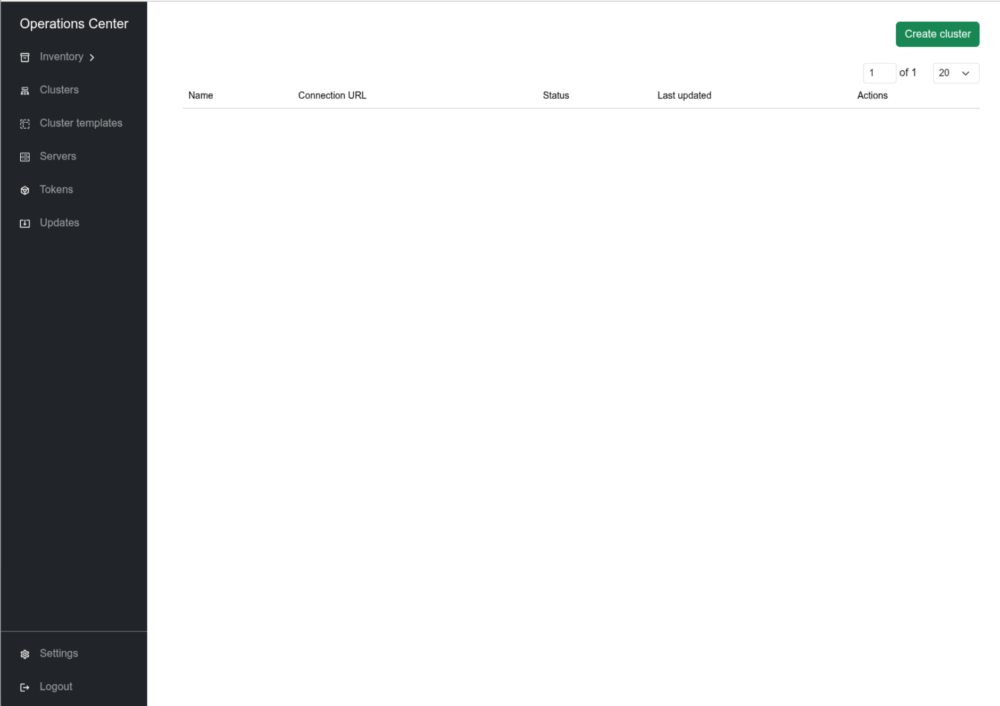
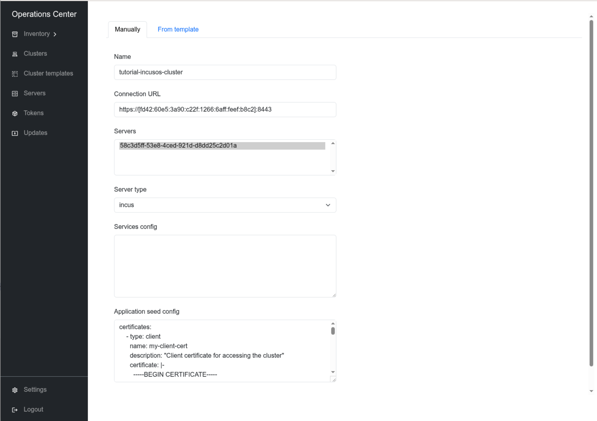

# Deploy IncusOS Cluster

This is an example guide for deploying an IncusOS cluster using Operations
Center. For this guide, we use Incus to run the IncusOS instances as virtual
machines.

For additional information about running IncusOS on Incus also refer to the
[IncusOS documentation](https://linuxcontainers.org/incus-os/docs/main/getting-started/installation/virtual-incus/).

## Prerequisites

In order to execute this guide, you need:

* a working Incus installation
* enough resources to run the virtual machines:
   * CPU (the more the better)
   * RAM, recommended 16 GB to allow 2 VM with 4 GB each + headroom for the host
     (it also works with 2 GB for each VM), for a cluster with multiple nodes,
     factor in additional RAM accordingly.
   * Disk space (~100 GB)
* Client certificate (`incus remote generate-certificate`)
* Recent version of the `operations-center` CLI, get the suitable version for
  your system from [GitHub releases](https://github.com/FuturFusion/operations-center/releases)

## Create a project (optional, but recommended)

```shell
incus project create tutorial-incusos-cluster
incus project switch tutorial-incusos-cluster

incus profile device add default eth0 nic network=incusbr0 name=eth0
incus profile device add default root disk pool=default path=/
```

## Get Operations Center ISO

Make sure, you have your client certificate ready.

```shell
incus remote get-client-certificate
```

`````{tabs}
````{group-tab} IncusOS Image Downloader

Visit [IncusOS image downloader](https://incusos-customizer.linuxcontainers.org/)
and configure your ISO as follows:

* Image type: `ISO`
* Image architecture: according to your system's architecture
* Image usage: `Installation`
* Image application: `Operations Center`
* Don't select `Wipe the target drive` and `Automatic reboot after installation`.
* Select `Apply default configuration`
* Insert your TLS client certificate
* No _Advanced settings_ are necessary

Hit **Download** to get the ISO and store it as `~/Downloads/IncusOS_OperationsCenter.iso`.

````

````{group-tab} Command line

Download the Operations Center ISO using the command-line:

```shell
OPERATIONS_CENTER_SEED_FILE=$(mktemp --suffix=.json)
cat << EOF > "${OPERATIONS_CENTER_SEED_FILE}"
{
  "seeds": {
    "install": {
      "version": "1",
      "force_install": false,
      "force_reboot": false
    },
    "applications": {
      "version": "1",
      "applications": [
        {
          "name": "operations-center"
        }
      ]
    },
    "operations-center": {
      "version": "1",
      "trusted_client_certificates": [
        $(incus remote get-client-certificate | jq -Rs .)
      ]
    }
  },
  "type": "iso",
  "architecture": "x86_64"
}
EOF

IMAGES_RESP=$(curl -s -X POST -d @${OPERATIONS_CENTER_SEED_FILE} "https://incusos-customizer.linuxcontainers.org/1.0/images")
DOWNLOAD_PATH=$(echo ${IMAGES_RESP} | jq -r '.metadata.image')
curl -o ~/Downloads/IncusOS_OperationsCenter.iso --compressed "https://incusos-customizer.linuxcontainers.org${DOWNLOAD_PATH}"
```

````

`````

## Install Operations Center

Import the ISO image as storage volume, create the Operations Center VM and
start the VM for the first time:

```shell
incus storage volume import default ~/Downloads/IncusOS_OperationsCenter.iso IncusOS_OperationsCenter.iso --type=iso

incus init --empty --vm OperationsCenter \
  -c security.secureboot=false \
  -c limits.cpu=4 \
  -c limits.memory=4GiB \
  -d root,size=50GiB
incus config device add OperationsCenter vtpm tpm
incus config device add OperationsCenter boot-media disk pool=default source=IncusOS_OperationsCenter.iso boot.priority=10

incus start OperationsCenter --console
```

This will first enroll the secure boot keys. After this is done, the following
message will be displayed:

```text
Enrolling secure boot keys from directory: \loader\keys\auto
Custom Secure Boot keys successfully enrolled, rebooting the system now!
```

Attach again to the console with:

```shell
incus console OperationsCenter
```

Wait for the first installation stage to complete with the following message:

```text
IncusOS was successfully installed.
Please remove the install media to complete the installation.
```

Exit the console (press `<ctrl>+a q`). You might want to reset your terminal
afterwards with `reset`.

Stop the VM, remove the install media and start the VM again:

```shell
incus stop OperationsCenter
incus config device remove OperationsCenter boot-media
incus start OperationsCenter --console
```

Wait for Operations Center to fully installed, which is the case when you see
the following message in the log output:

```text
System is ready
```

Note down the IP address displayed at the bottom of the screen.

Note down the server certificate fingerprint shown in the logs looking like this:

```text
2025-12-02 13:24:43 INFO Application TLS certificate fingerprint fingerprint=d3e2f6e179f062b29e1243af9b3826c4b1dbeac303586c1243ef5119da05fa93 name=operations-center
```

Exit the console again (`<ctrl>+a q`) and reset the terminal if necessary (`reset`).

## Access Operations Center

`````{tabs}
````{group-tab} CLI

Make sure, Operations Center CLI is using the client certificate and key we
used to seed the IncusOS installation ISO with and add the newly installed
Operations Center instance as a new remote `tutorial-operations-center` for
`operations-center` CLI.

Replace `<operations-center-ip>` with the IP address you noted down earlier.

While adding the new remote, `operations-center` CLI will prompt you to confirm
the server certificate fingerprint.

```shell
mkdir -p ~/.config/operations-center
cp ~/.config/incus/client.* ~/.config/operations-center/
operations-center remote add tutorial-operations-center https://<operations-center-ip>:8443 --auth-type tls
operations-center remote switch tutorial-operations-center
```

````
````{group-tab} Web UI

Follow the instructions in the
[Setup Operations Center UI tutorial](./setup-operations-center-ui.md) to set up
certificate-based authentication for the Operations Center UI.

Point your web browser to `https://<operations-center-ip>:8443` (replace
`<operations-center-ip>` with the IP address you noted down earlier) and log in
using your client certificate.

If everything worked as expected, you should see the Operations Center UI like
this:


````
`````

## Wait for Updates

As soon as Operations Center is up and running, it starts checking for updates
and will download them automatically.
The cached updates are also used as source for the pre-seeded IncusOS
installation images. Therefore, we need to wait for the updates to be downloaded
before we can continue with the deployment of the IncusOS instances.

`````{tabs}
````{group-tab} CLI

The following command lists all the available updates. As soon as there is
at least one update in state `ready` you can continue with the deployment.

```shell
operations-center provisioning update list
```

````
````{group-tab} Web UI

Navigate to *Updates*.



Wait until at least one update is in state `ready` before you continue with the
deployment.

````
`````

## Prepare for IncusOS Installation

`````{tabs}
````{group-tab} CLI

Create a new provisioning [token](../reference/token.md) for the IncusOS
installations and list the tokens to get the token `UUID`:

```shell
operations-center provisioning token add --description "IncusOS Cluster Tutorial" --uses 20
operations-center provisioning token list
```

Now get the pre-seeded installation ISO (this process may take a while):

```shell
operations-center provisioning token get-image <token> ~/Downloads/IncusOS.iso --architecture x86_64 --type iso
```

````
````{group-tab} Web UI

Navigate to *Tokens* and click *Issue token*.





Now get the pre-seeded installation ISO by clicking on the download action of
the newly created token and save it as `~/Downloads/IncusOS.iso`.



````
`````

## Install IncusOS

```{note}
In order to create a cluster with multiple IncusOS instances, repeat the steps
below for each instance.

Instead of naming all instances `IncusOS`, use unique names for each instance,
e.g. `IncusOS01`, `IncusOS02`, etc.
```

Import the ISO image as storage volume, create the IncusOS VM and
start the VM for the first time:

```shell
incus storage volume import default ~/Downloads/IncusOS.iso IncusOS.iso --type=iso

incus init --empty --vm IncusOS \
  -c security.secureboot=false \
  -c limits.cpu=4 \
  -c limits.memory=4GiB \
  -d root,size=50GiB
incus config device add IncusOS vtpm tpm
incus config device add IncusOS boot-media disk pool=default source=IncusOS.iso boot.priority=10

incus start IncusOS --console
```

This will first enroll the secure boot keys. After this is done, the following
message will be displayed:

```text
Enrolling secure boot keys from directory: \loader\keys\auto
Custom Secure Boot keys successfully enrolled, rebooting the system now!
```

Attach again to the console with:

```shell
incus console IncusOS
```

Wait for the first installation stage to complete with the following message:

```text
IncusOS was successfully installed.
Please remove the install media to complete the installation.
```

Exit the console (press `<ctrl>+a q`). You might want to reset your terminal
afterwards with `reset`.

Stop the VM, remove the install media and start the VM again:

```shell
incus stop IncusOS
incus config device remove IncusOS boot-media
incus start IncusOS --console
```

Wait for Operations Center to fully installed, which is the case when you see
the following message in the log output:

```text
System is ready
```

## Cluster the Servers

In order to be able to connect to the [cluster](../reference/cluster.md) with
Incus later on, we need to provide our client certificate as part of the
application configuration.

Make sure, you have your client certificate at hand (see at the beginning of
this guide, get it with `incus remote get-client-certificate`).

`````{tabs}
````{group-tab} CLI

Create a file `application-config.yaml` like this, past your client certificate
and make sure the indentation is correct:

```yaml
certificates:
  - type: client
    name: my-client-cert
    description: "Client certificate for accessing the cluster"
    certificate: |-
      <paste your client certificate here>
```

For the clustering step, the respective [servers](../reference/server.md),
that should be clustered, need to be registered with Operations Center and in
`ready` state.

If this is the case can be verified with the following command to list all
servers:

```shell
operations-center provisioning server list
```

```{note}
The server name in the server list defaults to the machine's host name, which if
not defined will default to the machine ID. Therefore it is normal for
setups based on this guide to have random UUID as the server names.
```

Note the server names from the list output for the following command.

```{note}
If you have created multiple IncusOS instances in the previous step, you need
to note all the server names and repeat the `--server-names` (or short `-s`)
flag for each server.
```

We use `tutorial-incusos-cluster` as the name of the cluster and the connection
URL of the first server as the `<connection-url>` of the cluster.

```{note}
For more serious setups, it is good practice to use e.g. DNS round robin or
a load balancer to access the cluster through all servers.
```

```shell
operations-center provisioning cluster add tutorial-incusos-cluster <connection-url> --server-names <server-name> --application-seed-config application-config.yaml
```

Check the existence of the newly created cluster with:

```shell
operations-center provisioning cluster list
```

````
````{group-tab} Web UI

Navigate to *Clusters* and click *Create cluster*.



Fill in the following details:

* Name: `tutorial-incusos-cluster`
* Connection URL: `<connection-url>` (use the connection URL of the first server)
* Select the servers to be part of the cluster (select all servers you created
  previously)
* Server type: `incus`
* Services configuration: leave empty for this tutorial
* Application seed config:
  ```
  certificates:
    - type: client
      name: my-client-cert
      description: "Client certificate for accessing the cluster"
      certificate: |-
        <paste your client certificate here>
  ```



Click the *Create* button to create the cluster.

After successful cluster creation, you should see the cluster in the list.

````
`````

```{note}
If the clustering fails, the cluster can be removed from Operations Center and
all the servers can be reset (factory reset) with the following command:
`operations-center provisioning cluster remove tutorial-incusos-cluster --mode=factory-reset`.

After this command, wait for all the servers to register again with Operations
Center. You can check the status with: `operations-center provisioning server list`.
Wait until all the server are in status `ready` again.
```

```{note}
For the sake of this guide, we have only specified a very minimal
[application configuration](../reference/cluster.md#application-configuration)
and no [service configuration](../reference/cluster.md#service-configuration)
at all during the clustering.

For more serious setups, you might want to look into the options these config
files offer.
```

Note down the connection URL and the fingerprint of the cluster for the next step.

## Access the IncusOS Cluster

In order to access the newly created Incus cluster, add it as a remote to Incus:

```shell
incus remote add tutorial-incusos-cluster <connection-url>
incus remote switch tutorial-incusos-cluster
```

Test the connection to Incus:

```shell
incus cluster list
```

If you want to access the Incus Web UI of the cluster, add your client
certificate to the trusted certificates:

```shell
incus config trust add-certificate .config/incus/client.crt
```

Now point your web browser to the connection URL of the cluster and you
should be able to log in using your client certificate.

## Terraform Configuration

In order to continue the configuration of the cluster with
[Terraform](https://developer.hashicorp.com/terraform) or
[OpenTofu](https://opentofu.org/), fetch the `terraform-configuration` artifact:

```shell
operations-center provisioning cluster artifact archive tutorial-incusos-cluster terraform-configuration ~/Downloads/tutorial-incusos-cluster-terraform.zip
```

Extract the content of the archive somewhere convenient, e.g.
`~/Downloads/tutorial-incusos-cluster-terraform`, enter the directory and
use `terraform` or `tofu` to manage your cluster:

```shell
mkdir -p ~/Downloads/tutorial-incusos-cluster-terraform
unzip ~/Downloads/tutorial-incusos-cluster-terraform.zip -d ~/Downloads/tutorial-incusos-cluster-terraform
cd ~/Downloads/tutorial-incusos-cluster-terraform
tofu init
tofu plan
cd -
```

## Start Over

If you want to start over with this tutorial and you created the project
at the beginning of this tutorial, you can simply delete the project including
all everything contained in the project with the following command:

```shell
incus project switch default
incus project delete tutorial-incusos-cluster --force
operations-center remote remove tutorial-operations-center
incus remote switch local
incus remote remove tutorial-incusos-cluster
```

## Debugging / Inspection

Since we are running the IncusOS instances as VM inside of Incus, you may enter
the respective VM with `incus exec <vm-name> -- bash` to inspect and debug.

See also the [Debugging](https://linuxcontainers.org/incus-os/docs/main/contributing/#debugging)
section in the IncusOS documentation.
