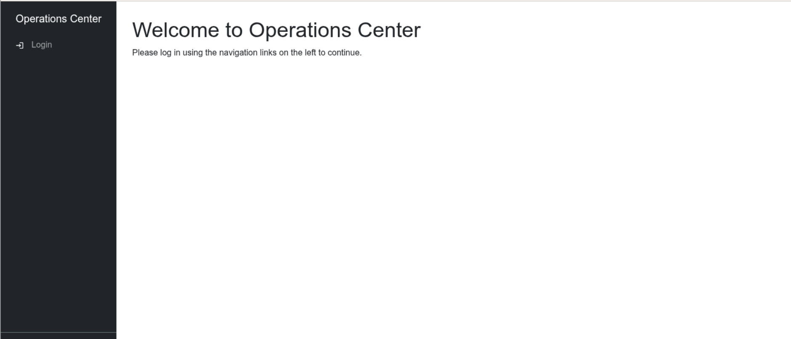
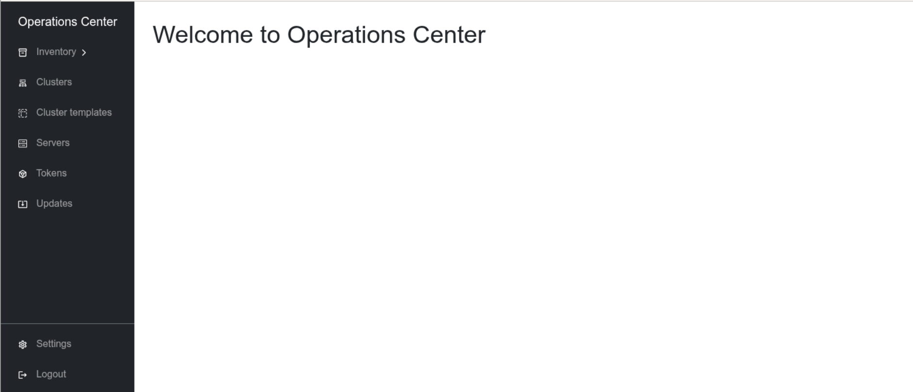

# Setup Operations Center UI

## Certificate Based Authentication

After installing Operations Center, you can access the Operations Center UI in
your web browser by accessing `https://<operations-center-ip>:8443` (replace
`<operations-center-ip>` with the actual IP address or host name of your
Operations Center instance).

Without further configuration, you will see a screen like this:



To set up certificate-based authentication for the Operations Center UI, follow
these steps:

1. Generate Client Certificate:

   If you don't already have a client
   certificate, the simplest way to generate one is by using
   `incus remote generate-certificate`, which will create a new client key and
   certificate pair for you. This is stored in your Incus client configuration
   directory (usually `~/.config/incus`).

   Get the fingerprint of the (existing or generated) certificate using:

   ```bash
   openssl x509 -noout -fingerprint -sha256 -in ~/.config/incus/client.crt
   ```

1. Add Certificate to Operations Center:

   Add the fingerprint of the client
   certificate to the list of trusted TLS client certificate fingerprints using
   the Operations Center CLI:

   ```bash
   operations-center system security edit
   ```

   This will open your default text editor. Add the fingerprint under the
   `trusted_tls_client_cert_fingerprints` section, for example:

   ```yaml
   trusted_tls_client_cert_fingerprints:
     - E7:1A:68:E0:B7:1A:5F:C0:A3:38:36:C0:AE:E0:6F:AD:4A:23:53:18:9D:8A:09:D4:95:14:1F:94:82:5C:A2:01
   ```

1. Convert Certificate to PKCS#12/PFX Format:

   For import of the client
   certificate into your browser, you have to convert the client certificate to
   PKCS#12/PFX format. This can be done using OpenSSL as follows:

   ```bash
   openssl pkcs12 -export -in ~/.config/incus/client.crt -inkey ~/.config/incus/client.key -out ~/.config/incus/client.pfx -name "Client Certificate"
   ```

   OpenSSL will prompt you to set a password for the PKCS#12 file.

1. Import Certificate into Browser:

   The next step is to import the
   generated PKCS#12/PFX file into your web browser. The process varies
   depending on the browser you are using:

   `````{tabs}
   ````{group-tab} Firefox
   1. Paste this link into the address bar:

      ```
      about:preferences#privacy
      ```

   2. Scroll down to the certificates section and click the View Certificates
      button.
   3. In the popup click `Your certificates` and then `Import`.
   4. Select the `.pfx` file generated. Enter your password, or leave the field
      empty if you have not set one.
   ````

   ````{group-tab} Chrome (Linux)
   1. Paste into the address bar:

      ```
      chrome://settings/certificates
      ```

   2. Click the `Import` button and select the `.pfx` file you generated.
      Enter your password, or leave the field empty if you have not set one.
   ````

   ````{group-tab} Chrome (Windows)
   1. Paste into the address bar:

      ```
      chrome://settings/security
      ```

   2. Scroll down to the `Advanced settings` and click
      `Manage device certificates`
   3. This opens a certificate management dialog. Click `Import...` then `Next`
   4. Select the `.pfx` file you generated. Enter your password, or leave the
      field empty if you have not set one.
   5. Click `Next`.
   6. Select `Automatically select the certificate store` and click `Next`, then
      click `Finish`.
   ````

   ````{group-tab} Edge
   1. Paste into the address bar:

      ```
      edge://settings/security
      ```

   2. Scroll down to the `Security` section and click
      `Manage Certificates`
   3. This opens a certificate management dialog. Click `Import...` then `Next`
   4. Select the `.pfx` file you generated. Enter your password, or leave the
      field empty if you have not set one.
   5. Click `Next`.
   6. Select `Automatically select the certificate store` and click `Next`, then
      click `Finish`.
   ````

   ````{group-tab} MacOS
   ```{note}
   The certificate must be protected by password. An empty password will fail to
   be imported on MacOS.
   ```

   1. Start the Keychain Access app on your Mac, select the login Keychain.
   2. Drag the `.pfx` file onto the Keychain Access app.
   3. If you are asked to provide a name and password, type the name and
      password for an administrator user on this computer.
   ````

   `````

1. Access Operations Center UI:

   Open your web browser and navigate to the
   Operations Center UI URL. When prompted, select the imported client
   certificate to authenticate.

Congratulations! You should now be logged into the Operations Center UI.


